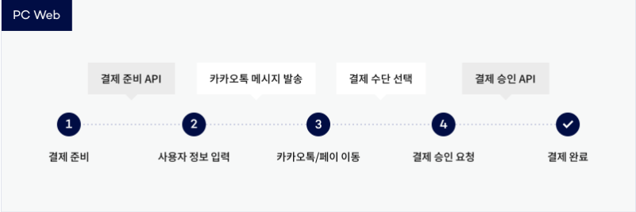
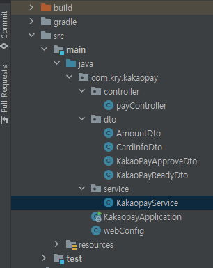
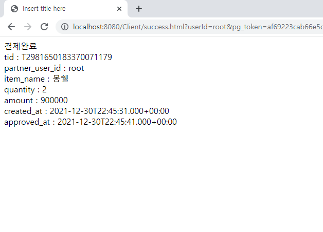

# KakaoPay sample

이전 프로젝트에서 kakaopay를 적용시켜 결제시스템을 구성했었다. 

하지만 면접준비를 하면서 이전 프로젝트들을 복기해 보다가 카카오페이 결제 프로세스 상 문제점이 있다는 것을 발견했다.

카카오페이 결제 프로세스는 준비-요청-승인 세가지 단계로 구성되는데 준비와 요청까지만 진행되고 마지막인 승인단계를 진행하지 않은 것이다.

공식문서의 결제 프로세스를 정확히 숙지하지 않고 핸드폰으로 요청이 넘어 왔으니 됐을거라고 안일하게 생각해 버린 것이 문제였다.

그래서 이번 기회에 Intellij와 gradle에 익숙해질 겸 새로운 환경에서 kakaopay 결제 시스템 sample을 만들어 봤다.


# kakaopay 결제 프로세스

프로젝트를 진행하기 앞서 kakaopay 결제 프로세스에 대해 공부 해야 한다.



kakaopay의 결제 프로세스는 위에 그림에서 보이는 것과 같이 결제 준비 API로 필요한 정보를 담아 요청하게 되면 next_redirect_pc_url을 통해 카카오에서 준비한 사용자 정보를 입력하는 페이지로 이동하게 된다.

그 이후에 사용자 정보를 입력하게 되면 입력된 정보에 해당하는 카카오톡 유저에게 결제요청을 위한 메시지를 발송하게 되고, 전달 받은 메시지를 통해 카카오페이로 이동하여 결제 준비과정에서 요청한 결제정보를 확인하고 결제 수단을 선택한 뒤에 결제 요청을 보내게 된다.

결제 요청이 정상적으로 성공하게 될 경우 approval_url에 넣어 놓았던 페이지로 이동하게 되고 준비 과정과 요청 과정에서 전달 받은 tid와 pg_token을 이용하여 결제승인 API로 전달하게 되면 결제 완료와 동시에 approve정보를 받을 수 있다.


# 개발 환경

이번 프로젝트는 web서버와 api서버를 분리해 놓았고 RESTful api를 이용하여 통신하는 것을 목표로 진행하였다.

api서버는 localhost:3000을 사용하였고 web서버는 localhost:8080을 사용하였다.

api서버는 spring boot를 이용하여 만들었지만 web서버의 경우는 ajax를 통해 비동기통신을 할 계획이었기 때문에 별 생각없이 그냥 쌩으로 만들었다.

프로젝트를 마무리 하고 난 다음에야 그냥 web도 spring을 이용해서 만들었다면 더 깔끔하게 만들었을 것 같다는 후회가 들기는 했지만 귀찮았기 때문에 그냥 진행했다.


# 프로젝트 진행



기본적인 api서버의 구성은 위의 그림과 같다.

web서버의 요청을 매핑하는 payController와 ready와 approve요청을 전달하는 kakaopayService, 그리고 요청 후에 결과를 받아내기 위한 dto 4가지로 이루어져 있다.


index.html

```html
<!DOCTYPE html>
<html>
<head>
<meta charset="UTF-8">
<title>kakaopay client</title>
<script src="https://code.jquery.com/jquery-3.5.0.js"></script>
</head>
<body>
<div>
kakaopay client
<table border=1>
	<tr>
		<td>ID</td>
		<td><input type="text" id="userId" size="20" value="root"></td>
	</tr>
	<tr>
		<td>상품명</td>
		<td><input type="text" id="product" size="20"></input></td>
	<tr>
	<tr>
		<td>가격</td>
		<td><input type="text" id="price" size="20"></input></td>
	<tr>
	<tr>
		<td>수량</td>
		<td><input type="text" id="quantity" size="20"></input></td>
	<tr>
</table>
<button onclick="ready()">결제</button>
</div>
<script type="text/javascript">
function ready(){
	$.ajax({
		type:"POST",
		url:"http://localhost:3000/ready",
		data:{userId:$("#userId").val(), product:$("#product").val(), price:$("#price").val(), quantity:$("#quantity").val()},
		success:function(resp){
			sessionStorage.setItem('tid',resp.tid);
			location.href=resp.next_redirect_pc_url;
		}
	});
}
</script>
</body>
</html>
```

결제 요청을 하기 위해 index.html을 가장 먼저 만들었다.

userId의 경우 계속 넣어주기 귀찮았기 때문에 value로 root를 미리 넣어놨고 상품명과 가격, 수량은 테스트 할때 마다 조금씩 바꿔가면서 테스트를 하고 싶었기 때문에 비워놓았다.

그리고 위에서 설명한대로 ajax를 통한 비동기 통신을 통해 api서버인 localhost:3000/ready로 전달해주었다.

ajax 통신이 성공했을때 tid를 sessionStroage에 저장해 놓았는데 사실 이부분을 어떻게 처리해야할지 고민을 많이 했었다.

tid의 경우 approve 요청시에 무조건 들어가야 하는 요소였는데 approve_url 등록 시점에서는 tid를 제공받지 못하기 때문에 이걸 어떻게 처리해야 될지 생각을 많이 하고 자료를 찾아 봤었는데, 대표적으로 두가지 방법이 있었다.

한가지는 위의 코드 처럼 sessionStorage에 저장해 놓았다가 sucess.html로 넘어가게 되는 경우, getItem을 통해 tid를 꺼내 와서 요청하는 방법이 있었고

또 한가지 방법은 데이터베이스를 구성하여 결제준비 시점의 order_id와 user_id를 저장하고 tid가 생성됐을때 order_id와 user_id를 이용하여 tid를 저장하고 approve_url에 order_id와 user_id를 동시에 넘겨 주어 tid를 데이터베이스에서 꺼내오는 방법있었다.

맨 처음에는 sessionStorage에 저장하는 것에 대해서 부정적인 생각을 가지고 있었고 결국에는 관리자 입장에서도 주문현황을 확인하기 위해 데이터베이스가 필요할 것이라고 판단했기 때문에 데이터베이스를 구현하는 방향으로 가닥을 잡았었지만 지속적인 고민을 통해 sessionStroage에 저장하는 방식으로 진행하였다.

두가지 방법 중 sessionStorage를 사용한 이유는 현재 상태가 결제 준비단계였기 때문에 어떻게 될지 모르는 데이터들을 계속해서 가지고 있는 것이 비합리적이라는 생각이 들었고 sessionStroage의 특성에 대해 공부해 보니 현재 탭에서만 적용된다는 부분이 이 결제 시스템과 사용하기에 적합하다는 생각이 들었기 때문이다.


payController.java

```java
package com.kry.kakaopay.controller;

import com.kry.kakaopay.dto.KakaoPayApproveDto;
import com.kry.kakaopay.dto.KakaoPayReadyDto;
import com.kry.kakaopay.service.KakaopayService;
import org.springframework.beans.factory.annotation.Autowired;
import org.springframework.web.bind.annotation.RequestMapping;
import org.springframework.web.bind.annotation.RequestMethod;
import org.springframework.web.bind.annotation.RestController;


@RestController
public class payController {

    @Autowired
    KakaopayService pService;

    //결제준비
    @RequestMapping(value = "ready", method = RequestMethod.POST)
    public KakaoPayReadyDto ready(String userId,String product, int price, int quantity){
        System.out.println("payController ready()");

        KakaoPayReadyDto kakaoPayReadyDto = pService.ready(userId, product,price,quantity);

        return kakaoPayReadyDto;
    }
    
    //결제요청
    @RequestMapping(value="approve", method = RequestMethod.POST)
    public KakaoPayApproveDto approve(String userId, String pg_token, String tid){
        System.out.println("payController approve()");

        KakaoPayApproveDto kakaoPayApproveDto = pService.approve(userId, pg_token, tid);
        
        return kakaoPayApproveDto;
    }
}

```

KakaoPayService.java

```java
package com.kry.kakaopay.service;

import com.kry.kakaopay.dto.KakaoPayApproveDto;
import com.kry.kakaopay.dto.KakaoPayReadyDto;
import org.springframework.http.HttpEntity;
import org.springframework.stereotype.Service;
import org.springframework.util.LinkedMultiValueMap;
import org.springframework.util.MultiValueMap;
import org.springframework.web.client.RestTemplate;

import java.net.URI;

@Service
public class KakaoPayService {

    //결제준비
    public KakaoPayReadyDto ready(String userId, String product, int price, int quantity){

        //URL 부분
        MultiValueMap<String, String> header = new LinkedMultiValueMap<String, String>();
        header.add("Authorization","KakaoAK ");
        header.add("Content-type","application/x-www-form-urlencoded;charset=utf-8");

        //Parameter 부분
        MultiValueMap<String, String> param = new LinkedMultiValueMap<String, String>();
        param.add("cid","TC0ONETIME");
        param.add("partner_order_id","1");
        param.add("partner_user_id",userId);
        param.add("item_name",product);
        param.add("quantity",Integer.toString(quantity));
        param.add("total_amount",Integer.toString(price*quantity));
        param.add("tax_free_amount","0");
        param.add("approval_url","http://localhost:8080/Client/success.html?userId="+userId);
        param.add("cancel_url","http://localhost:8080/Client/cancel.html");
        param.add("fail_url","http://localhost:8080/Client/fail.html");

        HttpEntity<MultiValueMap<String,String>> body = new HttpEntity<MultiValueMap<String,String>>(param, header);

        KakaoPayReadyDto kakaoPayReadyDto = null;
        RestTemplate restTemplate = new RestTemplate();

        try {
            kakaoPayReadyDto =restTemplate.postForObject(new URI("https://kapi.kakao.com/v1/payment/ready"),body, KakaoPayReadyDto.class);
        } catch(Exception e){
            e.printStackTrace();
        }

        return kakaoPayReadyDto;
    }
    
    //결제요청
    public KakaoPayApproveDto approve(String userId, String pg_token, String tid){

        //URL 부분
        MultiValueMap<String, String> header = new LinkedMultiValueMap<String, String>();
        header.add("Authorization","KakaoAK ");
        header.add("Content-type","application/x-www-form-urlencoded;charset=utf-8");

        //Parameter 부분
        MultiValueMap<String, String> param = new LinkedMultiValueMap<String, String>();
        param.add("cid","TC0ONETIME");
        param.add("tid",tid);
        param.add("partner_order_id","1");
        param.add("partner_user_id",userId);
        param.add("pg_token",pg_token);

        HttpEntity<MultiValueMap<String,String>> body = new HttpEntity<MultiValueMap<String,String>>(param, header);

        KakaoPayApproveDto kakaoPayApproveDto = null;
        RestTemplate restTemplate = new RestTemplate();

        try {
            kakaoPayApproveDto =restTemplate.postForObject(new URI("https://kapi.kakao.com/v1/payment/approve"),body, KakaoPayApproveDto.class);
        } catch(Exception e){
            e.printStackTrace();
        }
        return kakaoPayApproveDto;
    }
}

```

그 다음에는 Controller와 Service의 ready를 구현하였고 처음으로 `restTemplate`를 이용하여 통신을 하였다.

지난 프로젝트에서 `HttpURLConnection`을 사용한 것과는 다르게 이번 프로젝트에서는 `restTemplate`를 사용 했는데 확실의 전자에 비해서 추상화되고 간편화 되어 쓰기 편하다고 느껴졌다.

approval_url의 경우, userId를 url에 담아서 전송한 것을 확인할 수 있는데 실제 결제 상황에서는 session이나 jwt를 이용해서 사용자 정보를 확인할 수 있지만 현재 프로젝트에서는 그러한 기능을 구현하지 않았기 때문에 approval_url에 userId를 담아 전송해주었다.

kakaopay 요구사항은 [kakaopay 공식문서](https://developers.kakao.com/docs/latest/ko/kakaopay/single-payment)를 통해서 좀더 자세히 알 수 있다.


**※ Authorization의 경우, "KakaoAK " + Admin key 입력**

ex) "KakaoAK ce2e523fbea529c51e31c92d3f3989"

admin key의 경우 kakao developers에 가입하고 어플리케이션 추가를 통해서 얻을 수 있고, 어플리케이션의 플랫폼에서 web 플렛폼에 http://localhost:8080을 등록해 줘야 kakaopay 결제가 가능하다.


success.html

```html
<!DOCTYPE html>
<html>
<head>
	<meta charset="UTF-8">
	<title>Insert title here</title>
	<script src="https://code.jquery.com/jquery-3.5.0.js"></script>
	<script>
		function getParameter(name) {
		    name = name.replace(/[\[]/, "\\[").replace(/[\]]/, "\\]");
		    var regex = new RegExp("[\\?&]" + name + "=([^&#]*)"),
		        results = regex.exec(location.search);
		    return results === null ? "" : decodeURIComponent(results[1].replace(/\+/g, " "));
		}
	</script>
</head>
<body>
	
결제완료<br>
tid : <span id="tid"></span><br>
partner_user_id : <span id="partner_user_id"></span><br>
item_name : <span id="item_name"></span><br>
quantity : <span id="quantity"></span><br>
amount : <span id="amount"></span><br>
created_at : <span id="created_at"></span><br>
approved_at : <span id="approved_at"></span><br>


<script>
function approve(){
	$.ajax({
		type:"POST",
		url:"http://localhost:3000/approve",
		data:{userId:getParameter("userId"), pg_token:getParameter("pg_token"), tid:sessionStorage.getItem('tid')},
		success:function(resp){
			$("#tid").text(resp.tid);
			$("#partner_user_id").text(resp.partner_user_id);
			$("#item_name").text(resp.item_name);
			$("#quantity").text(resp.quantity);
			$("#amount").text(resp.amount.total);
			$("#created_at").text(resp.created_at);
			$("#approved_at").text(resp.approved_at);
		}
	});
}
approve();
</script>
</body>
</html>
```

결제요청을 성공하게 되면 approval_url에 pg_token이 담겨서 success.html로 이동하게 된다.

결제요청은 이미 성공한 상태이기 때문에 결제준비 단계에서 저장해 뒀던 tid값과 approval_url에 담아 두었던 userId와 pg_token을 꺼내서 approve요청을 하게 되면 결제 완료와 동시에 결제승인 정보를 전달 받게 된다. 




위와 같이 잘 전달되는 것을 확인할 수 있다.

# 성과

이전 프로젝트에서 일부 구현 해봤기 때문에 금방 끝낼 것이라고 예상했는데 구현하지 않은 부분에서 생각보다 고민할 거리가 많았고 이전에 해보지 않은 새로운 시도들을 많이 해볼 수 있는 기회가 되서 좋았다. 실제로 개발자로서 많이 성장한 시간이었다고 생각한다.

이전 프로젝트에서는 시간이 충분하지 않았기 때문에 고민보다는 실행과 행동으로 프로젝트를 진행했어야 했는데 이렇게 간단한 토이프로젝트를 진행하면서 실제 서비스에서는 어떤식으로 구현해야 좋은 프로그램일까라는 고민을 많이 하게 된 시간이었던 것 같다.
